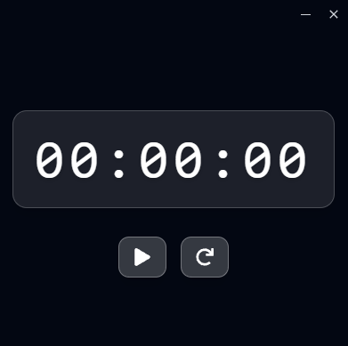

# Modern Clock



## Description

Just a simple stopwatch app made with Tauri and React.

## Getting started

### Prerequisites

- [Node.js](https://nodejs.org/en)
- [Rust](https://www.rust-lang.org/tools/install)

### Installation

1. Clone the repository:

   ```bash
   git clone https://github.com/TiagoRibeiro25/modern-clock-tauri.git
    cd modern-clock-tauri
    ```

2. Install dependencies:

    ```bash
    npm install
    ```

3. Run the app in development mode:

    ```bash
    npm run tauri dev
    ```

4. Build the app for production:

    ```bash
    npm run tauri build
    ```

## License

This project is licensed under the MIT License - see the [LICENSE](LICENSE) file for details.
